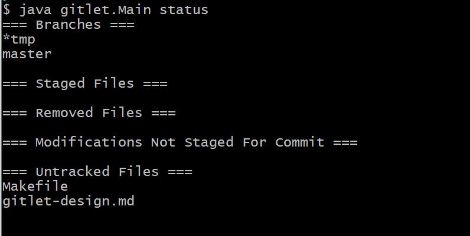
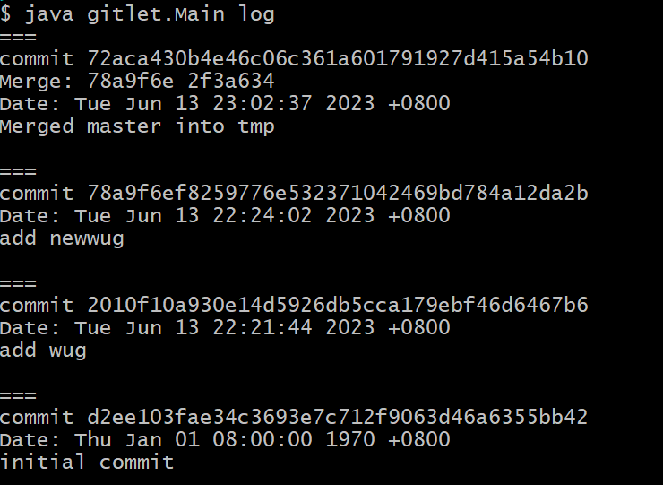

# CS61B-sp21
DS&amp;Algorithm in JAVA

## project0: 2048

## project1: Data Structures

## project2 : Gitlet

In this project, I developed a version control system called "Gitlet," which bears similarities to Git.

I have implemented the following commands: `init, add, commit, rm, log, status, checkout, merge, etc.`

Here are a few examples:

- status

- log

The specific code and design document can be found in the `proj2` folder.

